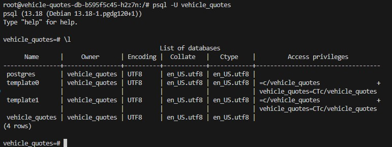

# Table of Contents
- [Table of Contents](#table-of-contents)
  - [Run deployment script](#run-deployment-script)
  - [Connect database pod \& list DB](#connect-database-pod--list-db)
  - [Create table](#create-table)
  - [To keep db state after delete pods](#to-keep-db-state-after-delete-pods)
  - [Apply \& Delete full](#apply--delete-full)
  - [Dump database](#dump-database)
  - [Restore database](#restore-database)

## Run deployment script
```bash
kubectl apply -f db-deployment.yaml
```

## Connect database pod & list DB
```bash
kubectl exec -it <pod-name> -- /bin/bash
psql -U vehicle_quotes
vehicle_quotes=# `\l`
```


## Create table
```bash
vehicle_quotes=# CREATE TABLE test (test_field varchar);
vehicle_quotes=# \dt
```

## To keep db state after delete pods
```bash
kubectl apply -f db-persistent-volume-claim.yaml
kubectl apply -f db-persistent-volume.yaml
```
In db-deployment.yaml
```yaml
apiVersion: apps/v1
kind: Deployment
metadata:
  name: vehicle-quotes-db
spec:
  selector:
    matchLabels:
      app: vehicle-quotes-db
  replicas: 1
  template:
    metadata:
      labels:
        app: vehicle-quotes-db
    spec:
      containers:
        - name: vehicle-quotes-db
          image: postgres:13
          ports:
            - containerPort: 5432
              name: "postgres"
          volumeMounts: # <- mount volume
            - mountPath: "/var/lib/postgresql/data"
              name: vehicle-quotes-postgres-data-storage
          env:
            - name: POSTGRES_DB
              value: vehicle_quotes
            - name: POSTGRES_USER
              value: vehicle_quotes
            - name: POSTGRES_PASSWORD
              value: password
          resources:
            limits:
              memory: 4Gi
              cpu: "2"
      volumes: # <- add volume
        - name: vehicle-quotes-postgres-data-storage
          persistentVolumeClaim:
            claimName: vehicle-quotes-postgres-data-persisent-volume-claim
```
Apply the changes
```bash
kubectl apply -k k8s
```
Create table and insert data
```bash
kubectl exec -it <pod-name> -- bash
psql -U vehicle_quotes
CREATE TABLE test (test_field varchar);
```
Delete the pods
```bash
kubectl delete -k k8s
```
Create new pods
```bash
kubectl apply -k k8s
```

## Apply & Delete full
```bash
kubectl apply -k k8s
kubectl delete -k k8s
```

## Dump database
```bash
kubectl exec -it <pod-name> -- pg_dump -U vehicle_quotes -d vehicle_quotes > persistent-backup.sql
```

## Restore database
```bash
cat persistent-backup.sql | kubectl exec -i <pod-name> -- psql -U vehicle_quotes -d vehicle_quotes
```